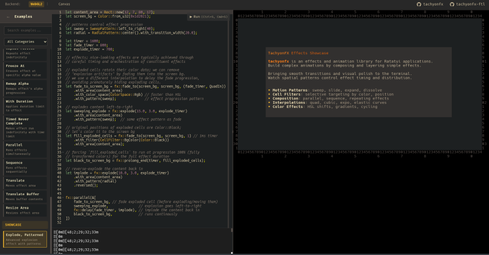
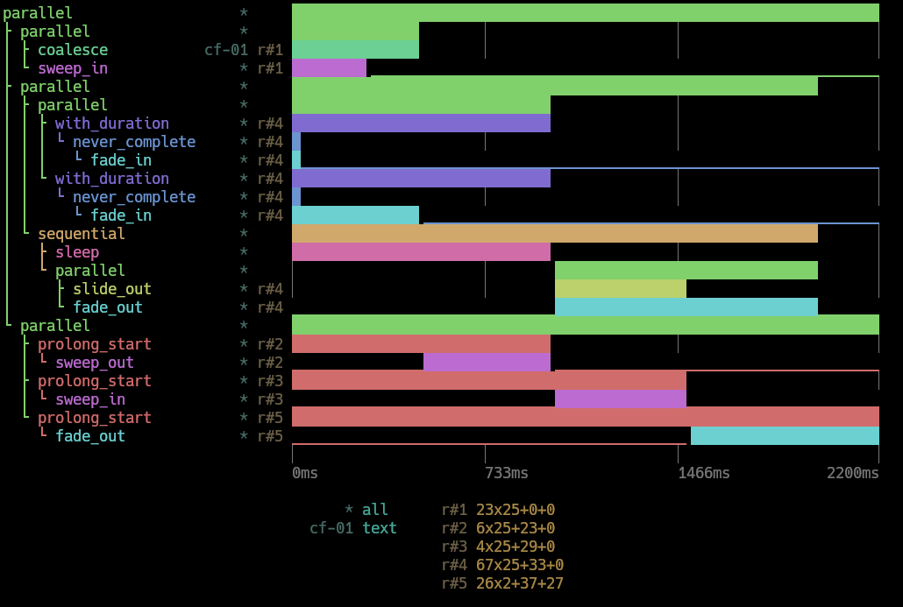

# Changelog

## unreleased
### Added
- `ratatui-next-cell` feature flag: opt-in support for ratatui > 0.30, where `Cell::skip`
  was replaced by `Cell::diff_option`. Enable this feature when using a newer ratatui.
- `blit_buffer` and `blit_buffer_region` now skip cells marked as skippable, restoring
  the behavior removed in 0.24.0.

## tachyonfx-0.25.0 - 2026-02-27
### Added
- `CellFilter::NonEmpty`: selects cells that contain a non-space symbol.
- `Interpolation::SmoothStep` and `Interpolation::Spring`.
- `DiamondPattern`: spatial pattern using Manhattan distance for diamond-shaped reveals.
- `SpiralPattern`: trig-free spatial pattern.
- `InvertedPattern`: wrapper pattern that inverts another pattern's output.
- `CombinedPattern`: combines two sub-patterns using a binary operation.

### Fixed
- Fix negative hue values producing wrong colors in `hsl_to_rgb`, `hsv_to_rgb`, and `hsl_shift`.
- `fx::sequence`: `reverse()` now reverses processing order of child effects
- `fx::parallel`: `reverse()` now right-aligns shorter children when reversed, so that all children end together


## tachyonfx-0.24.0 - 2026-02-14
### Added
- `wave_sin(t)`: fast, branchless parabolic sine approximation using normalized cycles (`1.0` = one period).
- `parabolic_sin(t)`: parabolic sine approximation accepting radians.
- `parabolic_cos(t)`: parabolic cosine approximation accepting radians.
- `WavePattern`: spatial pattern driven by composable wave interference. Built from `WaveLayer`s with FM/AM modulation, configurable contrast, and transition width.
- `BlendPattern`: spatial pattern that linearly interpolates between two sub-patterns, crossfading from one to the other over the effect's lifetime.
- `fx::saturate`, `fx::saturate_fg`: adjusts color saturation.
- `fx::lighten`, `fx::lighten_fg`: increases lightness toward white.
- `fx::darken`, `fx::darken_fg`: decreases lightness toward black.

### Changed
- `SimpleRng`: replace LCG with SplitMix32 for improved randomness quality
- Internal `sin()`/`cos()` now use `parabolic_sin`/`parabolic_cos` across both std and no_std builds.
- Internal `sqrt`, `round`, `floor`, `ceil` now always use micromath (faster than std in benchmarks).
- `rgb_to_hsl`: optimized with integer pipeline (~34% faster).
- `hsl_to_rgb`: uses direct sector computation (~31% faster).
- `rgb_to_hsv`: optimized with integer pipeline (~50% faster).

### Breaking
- `blit_buffer` and `blit_buffer_region` no longer skip cells with `Cell::skip`.
  Ratatui removed `Cell::skip` after 0.30.0; skip-cell filtering may be re-added
  once the replacement API stabilises.

### Fixed
- Replace `u16::is_multiple_of` with modulo operator for compatibility with Rust < 1.87.

## tachyonfx 0.23.0 - 2026-01-28

### Changed
- Replaced `ratatui` dependency with `ratatui-core`.

### Removed
- `EffectTimeline` widget.
- Example: `fx-chart`: removed along with `EffectTimeline`.

### Deprecated
- `EffectSpan`: scheduled for removal along with `EffectTimeline`.
- `Shader::as_effect_span()` and `Effect::as_effect_span()`: deprecated as part of `EffectSpan` removal.


## tachyonfx 0.22.0 - 2025-12-25

### Changed
- Ratatui dependency updated to 0.30.0


## tachyonfx 0.21.0 - 2025-12-07

### Added
- **DSL Completion Engine**: Context-aware autocompletion for DSL expressions with intelligent matching.
  - **Context-aware suggestions**: Understands namespaces, method chains, function  calls, and struct initialization.
  - **Fuzzy matching**: Filters completions using prefix, acronym, and subsequence matching.
  - **Type tracking**: Tracks `let` bindings and suggests variables where type-appropriate.
  - **Parameter hints**: Shows expected parameter types in function calls.
- `Effect::with_rng()` now properly supported by randomized effects for reproducible animations:
  - `fx::glitch`: Controls random cell selection and glitch types
  - `fx::dissolve`, `fx::dissolve_to`, `fx::coalesce`, `fx::coalesce_from`: Controls random cell thresholds
  - `fx::explode`: Controls explosion forces and trajectories
  - `fx::slide_in`, `fx::slide_out`: Controls random positional variance
  - `fx::sweep_in`, `fx::sweep_out`: Controls random positional variance

### DSL
- `SimpleRng` constructors (`SimpleRng::new`, `SimpleRng::default`) are now available in DSL expressions.

### Changed
- Replaced custom math approximations with `micromath` library for no_std builds.

### Fixed
- `CellIterator` now correctly iterates over buffers larger than 65535 cells. 


## tachyonfx 0.20.1 - 2025-10-19

### Fixed
- Resolve `Color::Reset` during color interpolation (fade and hsl effects). 


## tachyonfx 0.20.0 - 2025-10-19

### Added
- **DSL Examples in docs**: All DSL-supported effects now include interactive demo snippets in their documentation.
- `EffectManager::is_running()`: Returns whether there are any active effects.
- `EffectManager::cancel_unique_effect()`: Cancels a running unique effect by its key.

### DSL
- **`Layout` methods**: Added `.direction(Direction)` and `.flex(Flex)`.
- **Zero-argument validation**: DSL now properly rejects arguments passed to zero-argument constructors.

### Fixed
- fix `wasm` feature by updating internal `web-time` references.
- `DslParseError` is now exported when the `dsl` feature is enabled.


## tachyonfx 0.19.0 - 2025-09-27

[](https://junkdog.github.io/tachyonfx-ftl/?example=explode_patterned)

_The [documentation][tfx-fx-docs] for most effects now contain links to interactive examples powered by
[tachyonfx-ftl][tfx-ftl]_.

 [tfx-ftl]: https://junkdog.github.io/tachyonfx-ftl/
 [tfx-fx-docs]: https://docs.rs/tachyonfx/latest/tachyonfx/fx/index.html

### Added
- `fx::evolve`: Creates evolving text effects that transform characters through a series of symbols.
  Combine with `.with_pattern()` for progressive transformation.
- `fx::evolve_into`: Evolve effect variant that reveals underlying buffer content at completion (alpha=1.0).
- `fx::evolve_from`: Evolve effect variant that reveals underlying buffer content at the start (alpha=0.0).
- `EvolveSymbolSet` enum: Defines symbol progressions for evolve effects with variants:
  - `BlocksHorizontal`: Horizontal block progression (`▏▎▍▌▋▊▉█`)
  - `BlocksVertical`: Vertical block progression (`▁▂▃▄▅▆▇█`)
  - `CircleFill`: Circle fill progression (`◌◎◍●`)
  - `Circles`: Circle progression (` ·•◉●`)
  - `Quadrants`: Quadrant block progression (`▖▘▗▝▚▞▙▛▜▟█`)
  - `Shaded`: Shading progression (` ░▒▓█`)
  - `Squares`: Square progression (` ·▫▪◼█`)
- **`Pattern` trait**: New pattern-based spatial effects system for controlling how effects progress across screen areas:
  - `CheckerboardPattern`: Creates alternating checkerboard reveal patterns with configurable cell size and transition width
  - `CoalescePattern`: Randomized coalescing effects where cells activate at random thresholds for organic transitions
  - `DiagonalPattern`: Diagonal sweep effects in four directions (top-left to bottom-right, etc.) with smooth gradients
  - `DissolvePattern`: Randomized dissolve effects where cells deactivate at random thresholds - the reverse of `CoalescePattern`
  - `RadialPattern`: Radial expansion effects from configurable center points with parameterized transition widths
  - `SweepPattern`: Linear sweep effects in four cardinal directions (left-to-right, right-to-left, up-to-down, down-to-up)
- `Effect::with_pattern()`: Applies spatial patterns to pattern-compatible effects, supporting:
  - `fx::coalesce`, `fx::coalesce_from`
  - `fx::dissolve`, `fx::dissolve_to`,
  - `fx::evolve`, `fx::evolve_from`, `fx::evolve_into`
  - `fx::explode`
  - `fx::hsl_shift`, `fx::hsl_shift_fg`
  - `fx::fade_from`, `fx::fade_from_fg`,
  - `fx::fade_to`, `fx::fade_to_fg`
  - `fx::paint`, `fx::paint_fg`, `fx::paint_bg`
- **Interactive Examples**: DSL examples for most effects at <https://junkdog.github.io/tachyonfx-ftl/> and linked from docs.
- `fx::paint`: Applies color painting effects to foreground and background.
- `fx::paint_fg`: Paints only the foreground color.
- `fx::paint_bg`: Paints only the background color.

### Breaking Changes
- `fx::translate`: Changed from `translate(Option<Effect>, (i16, i16), timer)` to `translate(Effect, Offset, timer)`.

### DSL
- `CellFilter` method chaining: supports `.negated()`, `.into_static()`, and `.clone()` methods in DSL expressions.
- `fx::translate` effect now available in DSL expressions with full roundtrip support.
- [Documentation][dsl-docs] revised for conciseness and to reflect current DSL capabilities and limitations.

  [dsl-docs]: https://github.com/ratatui/tachyonfx/blob/development/docs/dsl.md

### Changed
- `FilterProcessor::validator()`: Changed visibility from `pub(crate)` to `pub`.
- `CellValidator`: Changed visibility from `pub(crate)` to `pub`.
- `CellValidator::is_valid()`: Changed visibility from `pub(crate)` to `pub`.

### Deprecated
- `FilterProcessor::predicate()`: Deprecated in favor of `validator()` method which provides better performance.
- `fx::resize_area()`: Deprecated due to poor design and functionality issues. No replacement planned.
- Feature `web-time`: Use the `wasm` feature instead.

### Fixed
- no_std compatibility: removed `simple-easing` crate dependency.
- no_std compatibility: removed implicit std math function usage with feature-gated implementations.
- Fixed `Interpolation::CubicOut` and `Interpolation::CubicInOut` incorrectly calling circular easing functions.
- Fixed `Interpolation::QuintIn` to use correct mathematical formula.
- `fx::remap_alpha`: Fixed incomplete reset implementation that could cause state persistence across effect resets.

### Removed
- `simple-easing` dependency: replaced with internal easing implementations for better no_std compatibility.


## tachyonfx 0.18.0 - 2025-09-07

### Breaking Changes
- Timer interpolation behavior: Effects that implicitly reverse timers (like `slide_out`, `coalesce`, etc.) now use
  `mirrored()` instead of `reversed()` to preserve interpolation curves. This affects the visual behavior of these
  effects when using asymmetric interpolation curves.

### Added
- `CellFilter::Static`: optimization wrapper that treats wrapped filters as static for performance.
- `CellFilter::into_static()`: convenience method to wrap a filter in `CellFilter::Static`.
- `CellFilter::negated()`: convenience method to wrap a filter in `CellFilter::Not`.
- `EffectTimer::mirrored()`: returns a timer with reversed direction and flipped interpolation, preserving the visual
  curve shape when used with effects that reverse at construction time.
- `Interpolation::flipped()`: returns an interpolation with In/Out variants swapped (e.g., `QuadIn` becomes `QuadOut`).

### Fixed
- `fx::effect_fn()` and `fx::effect_fn_buf()`: Fixed panic when `reset()` is called. These functions now properly
  preserve and restore original state during reset operations.
- Fixed issue where effects that reverse timers at construction-time would incorrectly flip interpolation curves.


## tachyonfx 0.17.1 - 2025-08-28

### Fixed
- `fx::expand()`: Now properly resets both internal stretch effects.
- `fx::offscreen_buffer()`: Now properly delegates reset to the wrapped effect.


## tachyonfx 0.17.0 - 2025-08-24

This release introduces several breaking changes, but shouldn't impact most existing codebases.

### Breaking Changes
- `Interpolatable` trait has been simplified from `Interpolatable<T>` to `Interpolatable`.
- **Effect API refactoring**: `Effect` no longer implements `Shader` trait; methods are now direct on `Effect`. 
- **Major ColorCache API overhaul**: The `ColorCache` API has been completely redesigned for improved flexibility and
  performance:
  - **Generic signature change**: `ColorCache<Context, const N: usize>` from `ColorCache<const N: usize>`
  - **Method signature changes**: 
    - Old: `memoize_fg(from: Color, to: Color, alpha: f32, f: F) -> Color`
    - New: `memoize_fg(from: Color, context: Context, f: F) -> Color`
    - Removed `to: Color` and `alpha: f32` parameters, replaced with generic `context: Context` parameter
- **CellFilter API optimization and restructuring**: Significant performance improvements through static filter analysis
  and bitmask caching, with breaking API changes:
  - **Method rename**: `CellFilter::selector()` → `CellFilter::predicate()` 
  - **Lifetime parameter added**: `CellPredicate` now requires lifetime parameter `CellPredicate<'_>`
  - **Ownership model change**: `CellPredicate` now borrows `CellFilter` instead of owning it
  - **Performance improvement**: Static filters (Area, Position, etc.) are pre-computed as bitmasks for O(1) lookups
- **LruCache**: The key type `K` now requires `Copy` in addition to existing bounds for performance optimizations.

### Added
- `std` feature flag: controls standard library usage. Disabling enables no-std compatibility for
  embedded environments and projects like [mousefood](https://github.com/j-g00da/mousefood).
- `CellIterator::for_each_cell()`: Performance-optimized method for iterating over cells without division and
  modulo operations. Recommended for all cell processing unless iterator combinators are needed.
- `fx::stretch()`: Creates a stretching effect that expands or shrinks rectangular areas using block characters (▏▎▍▌▋▊▉█).
- `fx::expand()`: Creates a bidirectional expansion effect that stretches outward from the center in both directions simultaneously.
- `FilterProcessor`: Automatically optimizes `CellFilter` evaluation by choosing between static 
  (pre-computed bitmask) and dynamic (per-cell evaluation) strategies. Implements `From<CellFilter>`.

### Changed
- `LruCache`: `V` is no longer required to implement `Clone`.
- `EffectManger` implements `Debug` trait.
- **Example restructuring**: Migrated all examples to independent Cargo workspace members:
  - `examples/common` crate with shared utilities (`gruvbox` color theme, `window` helper)
  - Examples now standalone crates with their own `Cargo.toml`
  - Run with `cargo run -p {example-name}` instead of `cargo run --example {name}`

### Removed
- Example: `dsl-playground`: as it was a poor example of the DSL and of little value.
- Example: `open-window`: removed due to its poor design and ergonomics.
- Removed `colorsys` dependency, only used for indexed color conversion.


## tachyonfx 0.16.0 - 2025-07-16

### Added
- `fx::dynamic_area`: wraps effects with dynamic area capabilities for responsive layouts.
- `RefRect`: a reference-counted, mutable rectangle for sharing areas between components.
- `fx::dispatch_event`: dispatches an event immediately when an effect starts, enabling coordination between visual effects and application logic.
- `fx::run_once`: wraps another effect and ensures it runs exactly once before reporting completion. Particularly useful for zero-duration effects in sequences and parallel compositions.
- `buffer_to_ansi_string()`: new function that replaces `render_as_ansi_string()` with configurable width handling for double-width characters.
- `ColorCache`: specialized LRU cache for color interpolation operations that automatically handles `Color::Reset` with appropriate fallback colors (white for foreground, black for background).

### DSL
- `RefRect` constructors (`RefRect::new`, `RefRect::default`) are now available in DSL expressions.
- `CellFilter::RefArea` now supports RefRect for shared area filtering in DSL expressions.
- `Size` supported in DSL expressions, including `Size::new` and struct initialization.
- `fx::run_once` added to the DSL.

### Deprecated
- `render_as_ansi_string()`: deprecated in favor of `buffer_to_ansi_string(buffer, false)` which provides the same behavior with more explicit control over cell handling.

### Fixed
- `render_as_ansi_string()` now properly handles unicode characters by detecting and skipping space cells that follow multi-width characters, eliminating extra spaces in ANSI output for emoji and CJK text.
- `LruCache`: fixed cache lookup logic to prevent false cache hits when looking up `Color::Reset` keys. The cache now correctly distinguishes between uninitialized entries (which default to `Color::Reset`) and actually cached `Color::Reset` values, ensuring effects work properly on cells with `Color::Reset` colors.
- `CellFilter::BgColor`: fixed bug where background color filtering was incorrectly checking the foreground color (`cell.fg`) instead of the background color (`cell.bg`).
- `Color::Reset` handling in effects: introduced `ColorCache` to properly handle `Color::Reset` in color interpolation operations. `Color::Reset` is now treated as `Color::White` for foreground colors and `Color::Black` for background colors during interpolation, matching typical terminal defaults. This ensures effects work correctly on cells with reset colors, which commonly occurs when widgets don't have explicit styling.


## tachyonfx 0.15.0 - 2025-04-27

### Added
- `fx::freeze_at`: freezes another effect at a specific alpha (transition) value.
- `fx::remap_alpha`: rescales an effect's alpha progression to a smaller window.
- trait `IntoTemporaryEffect`: previously not exposed although it was implemented for `Effect`.

### DSL
- the parsers now recognize boolean values.
- `.with_duration()` is now available on effects.
- `fx::freeze_at` added to the DSL.
- `fx::remap_alpha` added to the DSL.

### Changed`
- `fx::explode`: cells "behind" the explosion now have `Color::Black` instead of `Color::Reset` for
  for both foreground and background colors. This change makes it easier to apply later effects
  to the area underneath the explosion.

### Breaking Changes
- Changed how effect filters are applied and stored:
  - Effect filters are now stored as `Option<CellFilter>` instead of `CellFilter` directly
  - `Effect::with_filter` now uses filter propagation to preserve existing filters
  - Filters set on individual effects won't be overwritten during effect composition
  - Custom `Shader` implementations will need to update to store `cell_filter` as `Option<CellFilter>`
  - `default_shader_impl!(@filter)` macro users must update their field type from `CellFilter` to `Option<CellFilter>`


## tachyonfx 0.14.0 - 2025-04-21

### Changed`
- With the introduction of `LruCache::memoize_ref`, values no longer have to implement `Clone`.  

### Effect DSL
- Enhanced DslParseError with improved multi-line error handling and contextual error display.
- Update DslError messages to be more informative and user-friendly.
- Missing brackets are now reported with less misleading error messages.
- Improved error messages for missing semicolons.
- Added error messages for missing commas in DSL expressions.


## tachyonfx 0.13.0 - 2025-03-30

### Added
- `fx::explode`: explodes the content outward from the center.
- `LruCache::memoize_ref`: returns a reference to the cached value instead of cloning it.

### Fixes
- `CellFilter::AnyOf`, `CellFilter::NoneOf`: now correctly filter cells based on the provided filters.

### Improvements
- Optimized CellFilter evaluation, reducing overhead by ~30-50% depending on the filter type.


## tachyonfx 0.12.0 - 2025-03-26

### DSL Improvements

#### Improved Error Handling and Diagnostics

- **Improved Error Reporting**: Added source location tracking for DSL errors, making it easier to identify and fix issues in DSL expressions
  - New `DslParseError` type provides detailed context including:
    - Line and column numbers where errors occur
    - Visual context of the problematic code
    - Underlined error locations in the original source
  - `DslCompiler::compile()` now returns `Result<Effect, DslParseError>` instead of `Result<Effect, DslError>`

- **Source Position Tracking**: Added `ExprSpan` to track source locations throughout the parsing pipeline
  - Each expression node now includes its source position for accurate error reporting
  - Enables pinpointing specific tokens in error messages
  - Note that this feature has room for further improvements in future releases. It will occasionally point to the wrong
    token, depending on where and which category of parser intercepts the failure.

#### Internal Parser Improvements

- **Tokenization Pipeline**: Separated lexical analysis (tokenization) from syntax analysis (parsing).
- **Simplified AST**: Streamlined internal Abstract Syntax Tree representation
- **Source Position Tracking**: Added source position tracking to all AST nodes
- **Expression Promotion**: Converts qualified identifiers like `Motion::LeftToRight` to corresponding literal values.
- **DSL Serialization**: Improved DSL serialization with better formatting and source position tracking

#### Other Changes

- **Improved DSL Writer**: Enhanced DSL serialization with smarter line breaking and indentation.

### Added
- `CellFilter::Area`: filters cells within a specified rectangular area.
- `ColorSpace`: enum with `Rgb`, `Hsl`, and `Hsv` options for controlling color interpolation
  - Eliminates overhead of converting to/from colorsys representation; ~1/3 faster color conversions
- `color_from_hsl()`, `color_from_hsv()`, `color_to_hsl()`, `color_to_hsv()`: utility functions
- Added `Effect::with_color_space` to set the color space used for color interpolation
  - Modified effects to respect or propagate the selected color space
- `LruCache<K, V, N>`: const-capacity LRU cache for storing color conversions etc.

### Breaking Changes
- **Error Handling**: The error type for `DslCompiler::compile` has changed from `DslError` to `DslParseError`.

### Deprecated
- `HslConvertable`: deprecated in favor of new color space utilities
- `ColorMapper`: superseded by `LruCache`.

### Fixed
- `CellFilter::Not` now correctly inverts the behavior for all filter types.

## tachyonfx 0.11.1 - 2025-03-02

### Fixed
- Build now works with `default-features = false`.


## tachyonfx 0.11.0 - 2025-03-02

### Added
- New DSL (Domain Specific Language) for effect creation and composition:
  - String-based, rust-like expression syntax for defining effects
  - Support for variable binding and method chaining
  - Serialization of effects to DSL expressions via `Effect::to_dsl`
  - Support for custom effect registration via `EffectDsl::register`
- New `dsl` feature flag (enabled by default):
  - Adds DSL capabilities to the library
  - Depends on the [`anpa`](https://github.com/habbbe/anpa-rs) crate for parsing
- New example: `dsl-playground` for interactive testing of DSL expressions
- `EffectManager`: New component for managing collections of effects with lifecycle handling
  - Support for regular effects that run until completion
  - Support for unique effects that can be cancelled/replaced by new effects with the same ID
  - Automatic cleanup of completed effects and orphaned contexts
- New `web-time` feature flag for WebAssembly compatibility (thanks [@orhun](https://github.com/orhun/) for the contribution)
  - Adds support for using `web_time` crate instead of `std::time` when targeting WASM

### Changed
- Made crossterm backend optional via feature flags
  - Added `crossterm` feature (enabled by default)
  - Changed ratatui dependency to disable default features

### Breaking Changes
- Renamed HSL color conversion methods to avoid conflicts with Ratatui's "palette" feature:
  - `Color::from_hsl(h, s, l)` → `Color::from_hsl_f32(h, s, l)`
  - `color.to_hsl()` → `color.to_hsl_f32()`
   
  This is a short-term fix to prevent name clashes when using tachyonfx with Ratatui's palette feature enabled.

### Deprecated
- `Shader::set_cell_selection()`: renamed to `Shader::filter()`.
- `Shader::cell_selection()`: renamed to `Shader::cell_filter()`.

### Fixed
- `SimpleRng::gen_usize()`: Fixed panic on 32bit architectures 


## tachyonfx 0.10.1 - 2024-12-08

### Documentation
- Improved code examples with complete imports and explicit color values instead of theme references
- Updated motion-related documentation to use `Motion` enum instead of `Direction`

### Fixed
- `fx::effect_fn`/`fx::effect_fn_buf`: removed `Debug` requirement for state parameter.

### Breaking Changes introduced in 0.10.0
- Added `Debug` requirement to `Shader` trait - any custom shaders must now implement `Debug`


## tachyonfx 0.10.0 - 2024-12-07
### Added
- Implemented `Debug` for all effect types and supporting structs
- `fx::dissolve_to()`: dissolves both the characters and style over the specified duration.
- `fx::coallesce_from()`: reforms both the characters and style over the specified duration.
- Example gifs and better rustdoc for the [fx](https://docs.rs/tachyonfx/latest/tachyonfx/fx/index.html) module.

### Changed/Deprecated
- `Motion` replaces `Direction` to to avoid name clashing with ratatui's `Direction` enum.
  The deprecated `Direction` is a type alias for `Motion`.

### Fixed
- `fx::with_duration`: clarified misleading documentation.


## tachyonfx 0.9.3 - 2024-11-20

### Breaking Changes
- The `Shader` trait now requires the `Debug` trait to be implemented. This means that any
  user-defined effects must also implement `Debug`. 

### Fixed
- sweep and slide effects now honor applied CellFilters.

## tachyonfx 0.9.2 - 2024-11-17

### Fixed
- `Cargo.lock` no longer omitted from the crate package. This was an oversight in previous releases.
- Fixed test build failure when the `std-duration` feature is enabled.

## tachyonfx 0.9.0 - 2024-11-17

### Breaking Changes
#### Shader::execute() Signature Update
**Previous:**
```rust
fn execute(&mut self, alpha: f32, area: Rect, cell_iter: CellIterator)
```
**New:**
```rust
fn execute(&mut self, duration: Duration, area: Rect, buf: &mut Buffer)
```

When implementing the `Shader` trait, you must override one of these methods:

1. `execute()` (automatic timer handling)
    - Effect timer handling is done automatically; use for standard effects that rely on default timer handling
    - Most common implementation choice
2. `process()` (manual timer handling)
    - Use when custom timer handling is needed
    - Gives full control over timing behavior
    - Must report timer overflow via return value

**Important:** The default implementations of both methods are no-ops and cannot be used alone. You must override
at least one of them for a functioning effect.

### Added
- `CellFilter::EvalCell`: filter cells based on a predicate function that takes a `&Cell` as input.
- `blit_buffer_region()`: new function to support copying specific regions from source buffers.
- `render_buffer_region()` method added to `BufferRenderer` trait to enable region-based buffer rendering.

### Changed
- `blit_buffer()`: now omits copying cells where `cell.skip` is true. This behavior 
  also carries over to the `BufferRenderer` trait and `blit_buffer_region()`.

### Fixed
- `std-duration` feature: mismatched types error when building the glitch effect. Thanks 
  to [@Veetaha](https://github.com/Veetaha) for reporting. 

## tachyonfx 0.8.0 - 2024-10-21
This is just a tiny release in order to be compatible with the latest `ratatui` version.

### Added
- new `minimal` example demonstrating how to get started with tachyonfx. Thanks to @orhun for the contribution!

### Changed
- `Color::to_rgb`: updated rgb values of standard terminal colors to be more conformant.

### Breaking
- `ratatui` updated to 0.29.0. This is also the minimum version required for tachyonfx.

### Fixed
- `fx::repeat`: visibility of `RepeatMode` is now public.

## tachyonfx 0.7.0 - 2024-09-22

### Added
- `sendable` feature: Enables the `Send` trait for effects, shaders, and associated parameters. This allows effects to
be safely transferred across thread boundaries. Note that enabling this feature requires all `Shader` implementations
to be `Send`, which may impose additional constraints on custom shader implementations.
- `ref_count()`: wraps a value in an `Rc<RefCell<T>>` or an `Arc<Mutex<T>>` depending on the `sendable` feature.

### Changed
- `SlidingWindowAlpha`: Now uses multiplication instead of division when calculating alpha values for the gradient.
- `EffectTimer::alpha`: removed two redundant divisions.

### Fixed
- `EffectTimer::alpha` now correctly returns 0.0 for reversed timers with zero duration.
- `CellIterator` now uses the intersection of the given area and the buffer's area, preventing panics from
  out-of-bounds access.
- `fx::sweep_in`, `fx::sweep_out`, `fx::slide_in`, `fx::slide_out`: now uses a "safe area" calculated as the
  intersection of the effect area and buffer area, preventing out-of-bounds access.

## tachyonfx 0.6.0 - 2024-09-07

This release introduces a lot of breaking changes in the form of added and removed parameters.
Sorry for any inconvenience this may cause, I'll try to tread more carefully in the future.

### Added
- New "std-duration" feature to opt-in to using `std::time::Duration`, which is the same behavior as before.
- New `tachyon::Duration` type: a 4-byte wrapper around u32 milliseconds. When the "std-duration" feature is enabled,
  it becomes an alias for the 16-byte `std::time::Duration`.

### Changed
- Replaced `rand` crate dependency with a fast `SimpleRng` implementation.
- `render_as_ansi_string()` produces a more compact output by reducing redundant ANSI escape codes.

### Breaking
- `tachyonfx::Duration` is now the default duration type.
- Replace usage of `std::time::Duration` with `tachyonfx::Duration`.
- `fx::sweep_in`, `fx::sweep_out`, `fx::slide_in`, `fx::slide_out`: added `randomness` parameter.
- `fx::dissolve`, `fx::coalesce`: removed `cycle_len` parameter, as cell visibility is recalculated on the fly.
- `fx::sequence`, `fx::parallel`: now parameterized with `&[Effect]` instead of `Vec<Effect>`.

### Deprecated
- `EffectTimeline::from` is deprecated in favor of `EffectTimeline::builder`. 


## tachyonfx 0.5.0 - 2024-08-21


The effect timeline widget visualizes the composition of effects. It also supports rendering the
widget as an ansi-escaped string, suitable for saving to a file or straight to `println!()`.

### Added
- `fx::delay()`: delays the start of an effect by a specified duration.
- `fx::offscreen_buffer()`: wraps an existing effect and redirects its rendering
  to a separate buffer.  This allows for more complex effect compositions and can
  improve performance for certain types of effects.
- `fx::prolong_start`: extends the start of an effect by a specified duration.
- `fx::prolong_end`: extends the end of an effect by a specified duration.
- `fx::translate_buf()`: translates the contents of an auxiliary buffer onto the main buffer.
- `widget::EffectTimeline`: a widget for visualizing the composition of effects.
- `EffectTimeline::save_to_file()`: saves the effect timeline to a file.
- `BufferRenderer` trait: enables rendering of one buffer onto another with offset support.
  This allows for more complex composition of UI elements and effects.
- fn `blit_buffer()`: copies the contents of a source buffer onto a destination buffer with a specified offset.
- fn `render_as_ansi_string()`: converts a buffer to a string containing ANSI escape codes for styling.
- new example: `fx-chart`.

### Breaking
- Shader trait now requires `name()`, `timer()` and `as_effect_span()` methods.
- `ratatui` updated to 0.28.0. This is also the minimum version required for tachyonfx.


## tachyonfx 0.4.0 - 2024-07-14

### Added
- `CellFilter::PositionFn`: filter cells based on a predicate function.
- `EffectTimer::durtion()` is now public.
- `fx::slide_in()` and `fx::slide_out()`: slides in/out cells by "shrinking" the cells horizontally or
  vertically along the given area.
- `fx::effect_fn_buf()`: to create custom effects operating on a `Buffer` instead of `CellIterator`.
- `Shader::reset`: reinitializes the shader(*) to its original state. Previously, the approach was to
  clone the shader from a copy of the original instance, occasionally resulting in unintended behavior
  when certain internal states were expected to persist through resets.

*: _Note that "shader" here is used loosely, as no GPU is involved, only terminal cells._

### Breaking
- `fx::resize_area`:  signature updated with `initial_size: Size`, replacing the u16 tuple.

### Fixed
- `fx::translate()`: translate can now move out-of-bounds.
- `fx::translate()`: hosted effects with extended duration no longer end prematurely.
- `fx::effect_fn()`: effect state now correctly resets between iterations when using `fx::repeat()`, `fx::repeating()`
  and `fx::ping_pong()`. 
- `fx::resize_area()`: fixed numerous problems.

## tachyonfx 0.3.0 - 2024-06-30

### Changed
- `fx::effect_fn()`: updated the function signature to include an initial state parameter and `ShaderFnContext`
  context parameter. The custom effect closure now takes three parameters: mutable state, `ShaderFnContext`, and a
  cell iterator.
- `ratatui` updated to 0.27.0. This is also the minimum version required for tachyonfx.

## tachyonfx 0.2.0 - 2024-06-23

### Added
- `fx::effect_fn()`: creates custom effects from user-defined functions.
- Add `CellFilter::AnyOf(filters)` and `CellFilter::NoneOf(filters)` variants.
- Implemented `ToRgbComponents` trait for `Color` to standardize extraction of RGB components.

### Fixed
- `fx::translate()`: replace `todo!()` in cell_selection().
- 16 and 256 color spaces no longer output black when interpolating to a different color.

## tachyonfx 0.1.0 - 2024-06-20

Initial release of the library.
